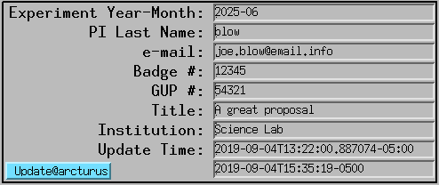

=====
Usage
=====

DMagic retrieves user and experiment information from the APS scheduling system. To initlialize DMagic status::

    $ dmagic init

this creates the DMagic config file: ~/dmagic.conf with default values.

To show the list of users currently running at the beameline:

::

    $ dmagic show

To update the EPICS PVs with data retrieved from the APS scheduling system run:

::

    $ dmagic tag

The information associated with the current user/experiment will be updated in the medm screen: 

For help and to access all options::

    dmagic -h
    dmagic show -h
    dmagic tag -h

