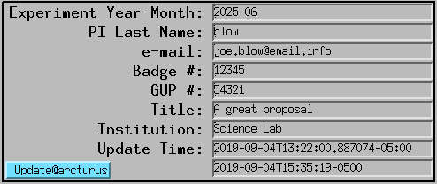

=====
Usage
=====

DMagic retrieves user and experiment information from the APS scheduling system and
integrates with the APS Data Management (DM) system (Sojourner) for experiment and
user access management.

Initialization
==============

To create the DMagic configuration file with default values::

    (dm) $ dmagic init

This creates ``~/dmagic.conf``. Edit the ``[site]`` section to configure it for your
beamline before using any other commands::

    [general]

    [settings]
    set = 0

    [site]
    beamline = 2-BM-A,B
    credentials = /home/beams/2BMB/.scheduling_credentials
    experiment-type = 2BM
    globus-message-file = message-2bm.txt
    globus-server-uuid = 054a0877-97ca-4d80-947f-47ca522b173e
    primary-beamline-contact-badge = 218262
    primary-beamline-contact-email = pshevchenko@anl.gov
    secondary-beamline-contact-badge = 49734
    secondary-beamline-contact-email = decarlo@anl.gov
    tomoscan-prefix = 2bmb:TomoScan:
    url = https://beam-api.aps.anl.gov
    verbose = True

    [manual]
    name = Staff
    title = Commissioning

    [local]
    data-host = tomodata3
    data-top-dir = /data3/2BM/

.. note::
    The ``[site]`` and ``[local]`` sections only need to be configured once per beamline
    installation. The ``[manual]`` section provides defaults for ``dmagic create-manual``.

Configuring for a different beamline
------------------------------------

The defaults baked into ``config.py`` are 2-BM values. To install DMagic at another
station, run ``dmagic init`` and then edit ``~/dmagic.conf`` — the ``[site]`` and
``[local]`` sections both need beamline-specific values.

**Known-good values for currently supported beamlines** (copy the column for your
station into your ``~/dmagic.conf``):

+----------------------------------------+-----------------------------------------+-----------------------------------------+-----------------------------------------+
| Key (``[site]``)                       | 2-BM                                    | 7-BM                                    | 32-ID                                   |
+========================================+=========================================+=========================================+=========================================+
| ``beamline``                           | ``2-BM-A,B``                            | ``7-BM-B``                              | ``32-ID-B,C``                           |
+----------------------------------------+-----------------------------------------+-----------------------------------------+-----------------------------------------+
| ``experiment-type``                    | ``2BM``                                 | ``7BM``                                 | ``32ID``                                |
+----------------------------------------+-----------------------------------------+-----------------------------------------+-----------------------------------------+
| ``globus-server-uuid``                 | ``054a0877-97ca-4d80-947f-47ca522b173e``| ``f7918e02-adb9-4012-b50a-8a70ff2d89c0``| ``480d21c2-8275-4603-b99e-5be328941b2a``|
+----------------------------------------+-----------------------------------------+-----------------------------------------+-----------------------------------------+
| ``globus-message-file``                | ``message-2bm.txt``                     | ``message-7bm.txt``                     | ``message-32id.txt``                    |
+----------------------------------------+-----------------------------------------+-----------------------------------------+-----------------------------------------+
| ``primary-beamline-contact-badge``     | ``218262``                              | ``56788``                               | ``324083``                              |
+----------------------------------------+-----------------------------------------+-----------------------------------------+-----------------------------------------+
| ``primary-beamline-contact-email``     | ``pshevchenko@anl.gov``                 | ``akastengren@anl.gov``                 | ``amittone@anl.gov``                    |
+----------------------------------------+-----------------------------------------+-----------------------------------------+-----------------------------------------+
| ``secondary-beamline-contact-badge``   | ``49734``                               | ``296791``                              | ``293228``                              |
+----------------------------------------+-----------------------------------------+-----------------------------------------+-----------------------------------------+
| ``secondary-beamline-contact-email``   | ``decarlo@anl.gov``                     | ``lxiaoyang@anl.gov``                   | ``vnikitin@anl.gov``                    |
+----------------------------------------+-----------------------------------------+-----------------------------------------+-----------------------------------------+
| ``tomoscan-prefix``                    | ``2bmb:TomoScan:``                      | ``7bmtomo:TomoScan:``                   | ``32id:TomoScan:``                      |
+----------------------------------------+-----------------------------------------+-----------------------------------------+-----------------------------------------+
| ``tomolog-home``                       | ``/home/beams/2BMB``                    | ``/home/beams/7BMB``                    | ``/home/beams/USERTXM``                 |
+----------------------------------------+-----------------------------------------+-----------------------------------------+-----------------------------------------+

The ``[local]`` section (``data-host`` and ``data-top-dir``) is host- and
data-layout-specific and must be set per install — the defaults in the fork point
at 2-BM's ``tomodata3:/data3/2BM/``. Ask the beamline staff for the correct values.

**Adding a new beamline** (e.g. 19-BM when it comes online):

1. Ask ``dm-admin@aps.anl.gov`` for the beamline's Globus endpoint UUID and
   the DM ``experiment_type`` name it should use.
2. Find the beamline's primary/secondary staff contacts (badge + email).
3. Confirm the beamline's ``tomoscan_prefix`` (EPICS IOC prefix) with the on-site team.
4. Extend the table above with the new column and set those values in
   ``~/dmagic.conf`` on the beamline's install host.

.. note::
    ``[site]`` options are suppressed from per-command ``--help`` output for brevity,
    but they are still valid CLI flags — for example
    ``dmagic email --globus-server-uuid <uuid>`` works if you want to override a
    single value for one invocation without editing ``~/dmagic.conf``.

Scheduling System Commands
==========================

dmagic show
-----------

Queries the APS scheduling REST API to display the currently active experiment::

    (dm) $ dmagic show
    2026-03-04 09:00:00,000 - Today's date: 2026-03-04 09:00:00.000000+00:00
    2026-03-04 09:00:00,700 -   Run: 2026-1
    2026-03-04 09:00:00,701 -   PI Name: Weinong Chen
    2026-03-04 09:00:00,702 -   PI affiliation: Purdue University
    2026-03-04 09:00:00,703 -   PI e-mail: wchen@purdue.edu
    2026-03-04 09:00:00,704 -   PI badge: 226531
    2026-03-04 09:00:00,705 -   Proposal GUP: 66310
    2026-03-04 09:00:00,706 -   ESAF number: 289884
    2026-03-04 09:00:00,707 -   Proposal Title: In-situ visualization of ...
    2026-03-04 09:00:00,708 -   Proposal type: GUP
    2026-03-04 09:00:00,709 -   Submitted: 2025-09-15
    2026-03-04 09:00:00,710 -   Granted shifts: 6  (scheduled: 6)
    2026-03-04 09:00:00,711 -   Proprietary: N  |  Mail-in: N
    2026-03-04 09:00:00,712 -   Start date: 2026_03_03
    2026-03-04 09:00:00,713 -   Start time: 2026-03-03 08:00:00-06:00
    2026-03-04 09:00:00,714 -   End Time: 2026-03-05 08:00:00-06:00
    2026-03-04 09:00:00,715 -   User email address:
    2026-03-04 09:00:00,716 -        user1@university.edu
    2026-03-04 09:00:00,717 -        user2@lab.gov

Use ``--set N`` to offset the date (negative for past, positive for future)::

    (dm) $ dmagic show --set -1500

dmagic tag
----------

Fetches the same scheduling data and writes it to EPICS PVs on the TomoScan IOC::

    (dm) $ dmagic tag
    2026-03-04 09:00:00,000 - Today's date: 2026-03-04 09:00:00.000000
    2026-03-04 09:00:01,000 - User/Experiment PV update
    2026-03-04 09:00:01,001 - Updating pi_name EPICS PV with: Weinong
    2026-03-04 09:00:01,002 - Updating pi_last_name EPICS PV with: Chen
    2026-03-04 09:00:01,003 - Updating pi_affiliation EPICS PV with: Purdue University
    2026-03-04 09:00:01,004 - Updating pi_email EPICS PV with: wchen@purdue.edu
    2026-03-04 09:00:01,005 - Updating pi_badge EPICS PV with: 226531
    2026-03-04 09:00:01,006 - Updating user_info_update_time EPICS PV with: 2026-03-04T09:00:01-06:00
    2026-03-04 09:00:01,007 - Updating proposal_number EPICS PV with: 66310
    2026-03-04 09:00:01,008 - Updating proposal_title EPICS PV with: In-situ visualization of ...
    2026-03-04 09:00:01,009 - Updating experiment_date EPICS PV with: 2026-03
    2026-03-04 09:00:01,010 - Updating esaf_number EPICS PV with: 289884

The information will be updated in the medm screen:

If no proposal is found in the scheduling system for the current run, ``dmagic tag``
exits cleanly with a message::

    2026-03-18 13:36:07,890 - No proposal found in the scheduling system for this run
    2026-03-18 13:36:07,891 - If you have a scheduled proposal: run 'dmagic create' to create the DM experiment
    2026-03-18 13:36:07,892 - For commissioning or manual runs: run 'dmagic create-manual' instead
    2026-03-18 13:36:07,893 - Then run 'dmagic tag-manual' to select the experiment and update the EPICS PVs

dmagic tag-manual
-----------------

Interactively lists all DM experiments for the station — both scheduling-based and
manually created, sorted newest first — and lets the operator choose which one to write
to the EPICS PVs::

    (dm) $ dmagic tag-manual
    2026-03-18 13:34:52,000 - Today's date: 2026-03-18 13:34:52.000000
    2026-03-18 13:34:52,500 - Found 3 DM experiment(s) for station 32ID:
      [ 0] 2026-03-Nikitin-0                    2026-03-01 to 2026-03-15  Commissioning
      [ 1] 32ID-TXM-CommissioningI              2025-03-04 to 2025-05-01  32-ID Operations Commissioning
      [ 2] 2025-TXM-CommissioningI              2025-03-14 to 2025-05-01  32-ID Technical Comissioning

    Select experiment to tag [0-2] or 'q' to quit: 0
    2026-03-18 13:34:55,000 - Selected DM experiment: 2026-03-Nikitin-0
    2026-03-18 13:34:55,100 - Using PI info parsed from DM experiment name (first name, institution, email, badge will be empty)
    2026-03-18 13:34:55,200 - User/Experiment PV update
    2026-03-18 13:34:55,201 - Updating pi_name EPICS PV with:
    2026-03-18 13:34:55,202 - Updating pi_last_name EPICS PV with: Nikitin
    2026-03-18 13:34:55,203 - Updating pi_affiliation EPICS PV with:
    2026-03-18 13:34:55,204 - Updating pi_email EPICS PV with:
    2026-03-18 13:34:55,205 - Updating pi_badge EPICS PV with:
    2026-03-18 13:34:55,206 - Updating user_info_update_time EPICS PV with: 2026-03-18T13:34:55-06:00
    2026-03-18 13:34:55,207 - Updating proposal_number EPICS PV with: 0
    2026-03-18 13:34:55,208 - Updating proposal_title EPICS PV with: Commissioning
    2026-03-18 13:34:55,209 - Updating experiment_date EPICS PV with: 2026-03
    2026-03-18 13:34:55,210 - Updating esaf_number EPICS PV with:

For scheduling-based experiments (non-zero GUP), full PI info is fetched from the
scheduling system automatically. This command is also useful when you need to switch
the EPICS PVs to a different user group mid-run without touching the scheduling system.

.. note::
    For commissioning runs with no scheduling proposal, the typical workflow is:

    1. ``dmagic create-manual`` — create the DM experiment
    2. ``dmagic tag-manual`` — activate it in the EPICS PVs
    3. ``dmagic email`` — notify users of their Globus data link (optional)
    4. ``dmagic daq-start`` — start automated file transfer (optional)

::

    (dm) $ dmagic tag-manual -h
    usage: dmagic tag-manual [-h] [--set SET] [--config FILE]

    Interactively pick a DM experiment and update user info EPICS PVs

    options:
      -h, --help     show this help message and exit
      --set SET      Number of +/- days offset from today for past/future user groups (default: 0)
      --config FILE  File name of configuration (default: /home/beams/2BMB/dmagic.conf)

DM Experiment Management
=========================

The ``create``, ``create-manual``, ``delete``, ``email``, ``daq-start``, ``daq-stop``,
``daq-status``, ``upload``, ``add-user``, ``remove-user``, ``list-users``, and
``list-esafs`` commands integrate with the APS Data Management (DM) system (Sojourner)
to manage experiment records, user data access via Globus, automated file transfer,
and ESAF queries. These commands require the ``[site]`` section of ``~/dmagic.conf``
to be correctly configured (see `Initialization`_ above). The ``daq-start`` and
``upload`` commands additionally require the ``[local]`` section to be configured with
the correct ``data-host`` and ``data-top-dir`` (``daq-stop`` and ``daq-status`` do
not — they read source info from the running DAQ records themselves).

DM data-directory format: ``dm-direct-mount``
---------------------------------------------

The ``[local]`` config knob ``dm-direct-mount`` controls how dmagic hands the
source path to the DM DAQ:

- ``dm-direct-mount = True`` (default at 2-BM) — dmagic passes the bare local
  path ``{data-top-dir}/{exp-name}`` to ``daq_api.upload()`` /
  ``startDaq()``. Correct when the DM VM already mounts the data
  filesystem directly (the 2-BM DM VM has both ``tomodata2:/data2`` and
  ``tomodata3:/data3`` mounted).
- ``dm-direct-mount = False`` — dmagic passes
  ``@{data-host}:{data-top-dir}/{exp-name}``. DM then rsyncs from the
  data host over SSH. This form has a bug on the 2-BM DM installation
  where ``daq_api.upload()`` returns ``countFiles=0`` with
  ``"no new files for upload"`` even for directories that contain matching
  files, so leave the default ``True`` unless a future DM release fixes it.

Passwordless SSH prerequisite (for source pre-check)
----------------------------------------------------

``dmagic upload`` and ``dmagic daq-start`` inspect the source directory
(``{data-top-dir}/{exp-name}`` and its ``_rec`` sibling) **before** dispatching to
DM, and warn if it is empty or missing. This is important because the DM DAQ silently
accepts a nonexistent source and reports "started successfully" while transferring zero
bytes — a misconfigured ``data-host`` / ``data-top-dir`` in ``~/dmagic.conf`` can
otherwise produce a successful-looking run with an empty destination.

The pre-check works two ways:

- If the host running dmagic already mounts the data directory (typical on beamline
  nodes like ``tomo1``, ``tomo3``, ``tocai``), the check is done locally with no setup.

- If dmagic is run from a control computer that does **not** mount ``/data2`` /
  ``/data3`` (typical on ``arcturus``), dmagic falls back to an SSH probe on the
  data host. This requires passwordless SSH to be set up **once**::

      # On the control computer, as 2bmb
      ssh-keygen -t ed25519 -N '' -f ~/.ssh/id_ed25519    # only if you don't have a key yet
      ssh-copy-id tomodata2
      ssh-copy-id tomodata3
      # verify
      ssh -o BatchMode=yes tomodata2 'echo ok'
      ssh -o BatchMode=yes tomodata3 'echo ok'

If SSH cannot be used (no key, host unreachable), dmagic logs a warning with the
setup steps above and dispatches to DM anyway — the pre-check is a safety net, not a
hard requirement.

dmagic create
-------------

Creates a DM experiment on Sojourner for a proposal-based beamtime. Lists all beamtimes
in the current APS run and prompts for selection, then creates the experiment and adds
all users from the scheduling proposal::

    (dm) $ dmagic create
    2026-03-04 09:00:00,000 - Found 3 beamtimes in run 2026-1:
      [ 0] GUP 1018528 - PI: Li - Investigation of multifunctional biomineralized ...
           2026-03-11 to 2026-03-14
      [ 1] GUP 1019623 - PI: Socha - Biomechanical constraints and trade-offs ...
           2026-03-07 to 2026-03-09
      [ 2] GUP 1012039 - PI: Li - Investigation of coupled mechanisms ...
           2026-03-03 to 2026-03-05

    Select beamtime [0-2] or 'q' to quit: 2
    2026-03-04 09:00:05,000 - Create summary:
    2026-03-04 09:00:05,001 -    Experiment : 2026-03/2026-03-Li-1012039
    2026-03-04 09:00:05,002 -    Title      : Investigation of coupled mechanisms ...
       *** Confirm? Yes or No (Y/N): Y
    2026-03-04 09:00:08,000 -    Experiment successfully created: 2026-03-Li-1012039
    2026-03-04 09:00:08,500 -    Added user Tao Li to the DM experiment
    2026-03-04 09:00:08,600 -    Added user Pavel Shevchenko to the DM experiment
    ...
    2026-03-04 09:00:09,000 - ============================================================
    2026-03-04 09:00:09,001 - Experiment name : 2026-03-Li-1012039
    2026-03-04 09:00:09,002 - Globus data link: https://app.globus.org/file-manager?...
    2026-03-04 09:00:09,003 - ============================================================

::

    (dm) $ dmagic create -h
    usage: dmagic create [-h] [--set SET] [--config FILE]

    Create a DM experiment from the APS scheduling system

    options:
      -h, --help     show this help message and exit
      --set SET      Number of +/- days offset from today for past/future user groups (default: 0)
      --config FILE  File name of configuration (default: /home/beams/2BMB/dmagic.conf)

dmagic create-manual
--------------------

Creates a DM experiment manually for commissioning runs or staff experiments that have
no scheduling proposal. PI name, title, and optional badge numbers are provided on the
command line. The experiment name is formatted as ``yyyy-mm-{LastName}-{gup}``.

Basic commissioning example (GUP 0, current month, 14-day window)::

    (dm) $ dmagic create-manual --name DeCarlo --first-name Francesco --title "2-BM commissioning"

With explicit GUP number and date range::

    (dm) $ dmagic create-manual --name DeCarlo --first-name Francesco \
              --title "2-BM run" --gup 1 --start 2026-05-01 --end 2026-05-07

If an invalid date format is entered, the command exits with an error::

    ERROR - Invalid --start '05/01/2026': expected format is yyyy-mm-dd (e.g. 2026-05-01)

::

    (dm) $ dmagic create-manual -h
    usage: dmagic create-manual [-h] [--badges BADGES] [--date DATE] [--email EMAIL]
                                [--end END] [--first-name FIRST_NAME] [--gup GUP]
                                [--institution INSTITUTION] [--name NAME]
                                [--start START] [--title TITLE] [--config FILE]

    Create a DM experiment manually for commissioning runs

    options:
      -h, --help            show this help message and exit
      --badges BADGES       Comma-separated badge numbers to add to the experiment (default: )
      --date DATE           Year-month in yyyy-mm format (default: current month) (default: )
      --email EMAIL         PI email address (default: )
      --end END             Experiment end date in yyyy-mm-dd format
                            (default: 14 days after --start or --date) (default: )
      --first-name FIRST_NAME
                            PI first name (default: )
      --gup GUP             GUP number (default: 0 = commissioning/no proposal) (default: 0)
      --institution INSTITUTION
                            PI institution (default: )
      --name NAME           PI last name (default: Staff)
      --start START         Experiment start date in yyyy-mm-dd format
                            (default: first day of --date month) (default: )
      --title TITLE         Experiment title (default: Commissioning)
      --config FILE         File name of configuration (default: /home/beams/2BMB/dmagic.conf)

dmagic delete
-------------

Deletes a DM experiment from Sojourner. Lists all experiments for the configured station
from the last 2 calendar years — this includes both proposal-based and manually created
experiments. Requires double confirmation before deleting::

    (dm) $ dmagic delete
    2026-03-04 22:49:10,028 - Found 11 DM experiment(s) for station 2BM:
      [ 0] 2026-03-Li-1018528                   2026-03-11 to 2026-03-14  Investigation of multifunctional biomineralized ...
      [ 1] 2026-03-Socha-1019623                2026-03-07 to 2026-03-09  Biomechanical constraints and trade-offs ...
      [ 2] 2026-03-Li-1012039                   2026-03-03 to 2026-03-05  Investigation of coupled mechanisms ...
      [ 3] 2026-03-DeCarlo-0                    2026-03-01 to 2026-03-15  Vibration Tests
      [ 4] 2026-03-Staff-0                      2026-03-04 to 2026-03-18  Commissioning
      ...
      [10] Nikitin-2025-06                      2025-06-23 to 2025-06-27  Viktor data from 2025-06

    Select experiment to delete [0-10] or 'q' to quit: 4
    2026-03-04 22:49:39,325 - ============================================================
    2026-03-04 22:49:39,326 - *** PERMANENT DELETION — THIS CANNOT BE UNDONE ***
    2026-03-04 22:49:39,327 -    Experiment     : 2026-03-Staff-0
    2026-03-04 22:49:39,328 -    Storage dir    : /gdata/dm/2BM/2026-03/2026-03-Staff-0
    2026-03-04 22:49:39,329 -    Data dir       : /gdata/dm/2BM/2026-03/2026-03-Staff-0/data
    2026-03-04 22:49:39,330 -    Analysis dir   : /gdata/dm/2BM/2026-03/2026-03-Staff-0/analysis
    2026-03-04 22:49:39,331 - ============================================================
       *** Are you sure? Yes or No (Y/N): Y
       *** Confirm AGAIN to permanently delete all data (Y/N): Y
    2026-03-04 22:49:46,336 - Deleting DM experiment: 2026-03-Staff-0
    2026-03-04 22:49:46,371 -    Experiment 2026-03-Staff-0 successfully deleted

To delete a manually created experiment directly by name (without going through the list)::

    (dm) $ dmagic delete --exp-name 2026-03-Staff-0

::

    (dm) $ dmagic delete -h
    usage: dmagic delete [-h] [--set SET] [--config FILE] [--exp-name EXP_NAME]

    Delete a DM experiment from Sojourner

    options:
      -h, --help           show this help message and exit
      --set SET            Number of +/- days offset from today for past/future user groups (default: 0)
      --config FILE        File name of configuration (default: /home/beams/2BMB/dmagic.conf)
      --exp-name EXP_NAME  [Optional] Full DM experiment name, used only to delete commissioning
                           experiments created with "dmagic create-manual" that are not in the
                           APS scheduling system (e.g. 2026-03-Staff-0). Leave blank to select
                           from the list of all station experiments. (default: None)

dmagic email
------------

Sends a data-access notification email with a Globus link to users on a DM
experiment. Lists all station experiments and prompts for selection. Requires that
``dmagic create`` or ``dmagic create-manual`` has been run first.

The command tracks which users have already received the email (stored as DM experiment
metadata). If new users were added to the experiment since the last email was sent, it
offers to email only the new users or all users. This is useful when users are added
mid-experiment after the initial notification has already gone out.

**First-time send** (no previous email recorded)::

    (dm) $ dmagic email
    2026-03-04 09:05:00,000 - Found 11 DM experiment(s) for station 2BM:
      [ 0] 2026-03-Li-1018528                   2026-03-11 to 2026-03-14  Investigation of ...
      [ 1] 2026-03-Socha-1019623                2026-03-07 to 2026-03-09  Biomechanical ...
      ...

    Select experiment to email [0-10] or 'q' to quit: 0
    2026-03-04 09:05:05,000 - Sending e-mail to users on the DM experiment: 2026-03-Li-1018528
    2026-03-04 09:05:05,100 -    Message to users:
    2026-03-04 09:05:05,200 -    *** Subject: Important information for APS experiment ...
    ...
    Send email to users?
       *** Yes / No / Test (Y/N/T): Y
    2026-03-04 09:05:06,000 -    Sending informational message to user1@university.edu
    2026-03-04 09:05:06,100 -    Sending informational message to pshevchenko@anl.gov

**Re-send when new users were added**::

    (dm) $ dmagic email
    ...
    Select experiment to email [0-10] or 'q' to quit: 0
    2026-03-04 10:00:00,000 -    3 user(s) already emailed previously, 1 new user(s) added:
    2026-03-04 10:00:00,100 -       Sarah D. Boyer (d313356)
    Email [A]ll users / [O]nly new users / [C]ancel: O
    Send email to users?
       *** Yes / No / Test (Y/N/T): Y
    2026-03-04 10:00:05,000 -    Sending informational message to newuser@university.edu
    2026-03-04 10:00:05,100 -    Sending informational message to pshevchenko@anl.gov

**Re-send when all users already emailed**::

    (dm) $ dmagic email
    ...
    Select experiment to email [0-10] or 'q' to quit: 0
    2026-03-04 10:00:00,000 -    All 4 user(s) have already been emailed previously.
    Re-send to [A]ll users / [C]ancel: A
    2026-03-04 10:00:05,000 -    Sending informational message to user1@university.edu
    ...

The email includes a Google Slides presentation URL. dmagic looks it up in
``{tomolog-home}/.tomolog`` (a YAML history file written by ``tomolog``)
using the GUP number in the experiment name — most recent entry wins. If
tomolog has not been run for this experiment, or you want to override
the lookup with a specific deck, pass ``--presentation-url``::

    (dm) $ dmagic email --presentation-url \
             'https://docs.google.com/presentation/d/XXXXXXXXXXXX/edit?usp=sharing'

::

    (dm) $ dmagic email -h
    usage: dmagic email [-h] [--config FILE] [--presentation-url URL]

    Send data-access email with Globus link to users on the DM experiment

    options:
      -h, --help              show this help message and exit
      --config FILE           File name of configuration (default: /home/beams/2BMB/dmagic.conf)
      --presentation-url URL  Google Slides URL to include in the email. If omitted
                              (default), dmagic looks the URL up in
                              {tomolog-home}/.tomolog by GUP number. Pass this when
                              tomolog was not run yet or you want to email a
                              specific deck.

dmagic daq-start
----------------

Starts automated file transfer (DAQ) to Sojourner. On start, the DM system uploads
every file already present in the experiment directory, then continues to sync
new or changed files as they arrive. Runs until stopped with ``dmagic daq-stop``.

Because it also handles pre-existing files, ``daq-start`` can be issued at any point —
before, during, or after data collection — and will still catch every file in the
directory. Two DAQ processes are started for each experiment:

- **Raw data**: ``{data-top-dir}/{exp-name}`` on the data host → DM ``data/`` directory
- **Reconstructed data**: ``{data-top-dir}/{exp-name}_rec`` → DM ``analysis/`` directory

The rec DAQ is skipped with a warning if the ``_rec`` directory does not yet exist —
run ``dmagic daq-start`` again once reconstruction begins to pick it up.
If a DAQ is already running for a given directory it is left untouched.

::

    (dm) $ dmagic daq-start
    2026-07-22 09:10:00,000 - Found 11 DM experiment(s) for station 2BM:
      [ 0] 2026-07-DeCarlo-0                    2026-07-20 to 2026-08-03  delete_test
      [ 1] 2026-07-Liu-0                        2026-07-18 to 2026-08-01  Test_root
      ...

    Select experiment to start DAQ for [0-10] or 'q' to quit: 0
    2026-07-22 09:10:05,000 - Starting raw data DAQ for experiment 2026-07-DeCarlo-0
    2026-07-22 09:10:05,100 -    Watching directory: /data3/2BM/2026-07-DeCarlo-0
    2026-07-22 09:10:05,200 -    DAQ started successfully

The ``data-host`` and ``data-top-dir`` settings in ``~/dmagic.conf`` control which
host and directories are monitored. For best performance, point ``data-host`` at the
storage node (e.g. ``tomodata3``) that physically hosts the data rather than a compute
node that accesses it via NFS. Internally ``dmagic`` passes ``processExistingFiles=True``
to ``daq_api.startDaq()`` so both pre-existing and newly-arriving files are transferred.

::

    (dm) $ dmagic daq-start -h
    usage: dmagic daq-start [-h] [--data-host DATA_HOST] [--data-top-dir DATA_TOP_DIR]
                            [--dm-direct-mount | --no-dm-direct-mount] [--config FILE]

    Upload all existing files in the experiment directory and continue to sync
    new files as they arrive

dmagic daq-stop
---------------

Lists only experiments that currently have running DAQs for the station (skipping the
full experiment list) and stops all DAQs for the one you select. If no DAQs are
running, exits cleanly with a message and no prompt::

    (dm) $ dmagic daq-stop
    2026-07-22 18:00:00,000 - Found 1 experiment(s) with running DAQ(s) for station 2BM:
      [ 0] 2026-07-DeCarlo-0                    1 DAQ(s)  /data3/2BM/2026-07-DeCarlo-0

    Select experiment to stop DAQ for [0-0] or 'q' to quit: 0
    2026-07-22 18:00:05,000 - Stopping all DM DAQs for experiment 2026-07-DeCarlo-0
    2026-07-22 18:00:05,100 -    Found running DAQ. Stopping now.
    2026-07-22 18:00:06,000 -    Stopped 1 DAQ(s) for experiment 2026-07-DeCarlo-0

::

    (dm) $ dmagic daq-stop -h
    usage: dmagic daq-stop [-h] [--config FILE]

    List experiments with active DAQs and stop the one you select

dmagic daq-status
-----------------

Read-only. Lists every currently-running DM DAQ for the station: experiment name,
source directory, files completed / total, percentage complete, runtime, DAQ start
timestamp, and DAQ id. Useful before ``daq-stop`` to see what is running, or during a
long-running acquisition to confirm files are being processed::

    (dm) $ dmagic daq-status
    2026-07-22 21:07:17,226 - Found 1 running DM DAQ(s) for station 2BM:
    2026-07-22 21:07:17,226 -    2026-07-DeCarlo-0
    2026-07-22 21:07:17,226 -      dir      : /data3/2BM/2026-07-DeCarlo-0
    2026-07-22 21:07:17,226 -      files    : 1 / 1  (100.00%)
    2026-07-22 21:07:17,226 -      runtime  : 782s
    2026-07-22 21:07:17,226 -      started  : 2026/07/22 20:54:13 CDT
    2026-07-22 21:07:17,226 -      id       : 910d0df6-f0c6-4e95-b450-60ae4283462d

::

    (dm) $ dmagic daq-status -h
    usage: dmagic daq-status [-h] [--config FILE]

    List all running DM DAQs for the current station

dmagic upload
-------------

Now largely redundant with ``dmagic daq-start`` — kept as a **fallback** for the case
where ``daq-start`` was not running while data was being collected and you want to
one-shot transfer everything currently on disk without registering a persistent DAQ.

Under the hood: ``upload()`` transfers every file present at the moment the command
runs, then exits. ``daq-start`` now uploads the same set (thanks to
``processExistingFiles=True``) **and** keeps watching for new files, so for normal
operation prefer ``daq-start``. The same two directories are used:

- **Raw data**: ``{data-top-dir}/{exp-name}`` → DM ``data/`` directory
- **Reconstructed data**: ``{data-top-dir}/{exp-name}_rec`` → DM ``analysis/`` directory

The rec upload is skipped with a warning if the ``_rec`` directory does not exist::

    (dm) $ dmagic upload
    2026-07-22 10:00:00,000 - Found 11 DM experiment(s) for station 2BM:
      [ 0] 2026-07-DeCarlo-0                    2026-07-20 to 2026-08-03  delete_test
      ...

    Select experiment to upload data for [0-10] or 'q' to quit: 0
    2026-07-22 10:00:05,000 - Uploading raw data for experiment 2026-07-DeCarlo-0
    2026-07-22 10:00:05,100 -    Source: /data3/2BM/2026-07-DeCarlo-0
    2026-07-22 10:00:05,200 -    Raw data upload dispatched to DM

::

    (dm) $ dmagic upload -h
    usage: dmagic upload [-h] [--data-host DATA_HOST] [--data-top-dir DATA_TOP_DIR]
                         [--dm-direct-mount | --no-dm-direct-mount] [--config FILE]

    One-shot upload of all existing files to Sojourner (fallback for when daq-start
    was not running during data collection)

dmagic add-user
---------------

Adds one or more users to an existing DM experiment by badge number. Lists all station
experiments and prompts for selection, then prompts for badge number(s) if not provided
on the command line::

    (dm) $ dmagic add-user
    2026-03-05 14:32:00,000 - Found 10 DM experiment(s) for station 2BM:
      [ 0] 2026-03-Li-1018528                   2026-03-11 to 2026-03-14  Investigation of ...
      [ 1] 2026-03-Socha-1019623                2026-03-07 to 2026-03-09  Biomechanical ...
      [ 2] 2026-03-Li-1012039                   2026-03-03 to 2026-03-05  Investigation of ...
      ...

    Select experiment to add users to [0-9] or 'q' to quit: 2
    Enter badge number(s) to add (comma-separated): 12345,67890
    2026-03-05 14:32:10,000 -    Added user Jane Smith to the DM experiment
    2026-03-05 14:32:10,100 -    Added user John Doe to the DM experiment

Badge numbers can also be passed directly on the command line::

    (dm) $ dmagic add-user --badges 12345,67890

::

    (dm) $ dmagic add-user -h
    usage: dmagic add-user [-h] [--set SET] [--config FILE] [--badges BADGES]

    Add users to an existing DM experiment by badge number

    options:
      -h, --help       show this help message and exit
      --set SET        Number of +/- days offset from today for past/future user groups (default: 0)
      --config FILE    File name of configuration (default: /home/beams/2BMB/dmagic.conf)
      --badges BADGES  Comma-separated badge number(s) to add to the experiment (e.g. 12345 or 12345,67890) (default: )

dmagic remove-user
------------------

Removes one or more users from an existing DM experiment by badge number. Lists all
station experiments and prompts for selection, then shows the current user list before
prompting for badge number(s) to remove::

    (dm) $ dmagic remove-user
    2026-03-06 09:00:00,000 - Found 10 DM experiment(s) for station 2BM:
      [ 0] 2026-03-Li-1018528                   2026-03-11 to 2026-03-14  Investigation of ...
      [ 1] 2026-03-Socha-1019623                2026-03-07 to 2026-03-09  Biomechanical ...
      [ 2] 2026-03-Li-1012039                   2026-03-03 to 2026-03-05  Investigation of ...
      ...

    Select experiment to remove users from [0-9] or 'q' to quit: 2
    2026-03-06 09:00:05,000 - Current users on 2026-03-Li-1012039:
    2026-03-06 09:00:05,001 -    d12345
    2026-03-06 09:00:05,002 -    d49734
    2026-03-06 09:00:05,003 -    d218262
    Enter badge number(s) to remove (comma-separated): 12345
    2026-03-06 09:00:10,000 -    Removed user Jane Smith from the DM experiment

Badge numbers can also be passed directly on the command line::

    (dm) $ dmagic remove-user --badges 12345

::

    (dm) $ dmagic remove-user -h
    usage: dmagic remove-user [-h] [--set SET] [--config FILE] [--badges BADGES]

    Remove users from an existing DM experiment by badge number

    options:
      -h, --help       show this help message and exit
      --set SET        Number of +/- days offset from today for past/future user groups (default: 0)
      --config FILE    File name of configuration (default: /home/beams/2BMB/dmagic.conf)
      --badges BADGES  Comma-separated badge number(s) to add/remove (e.g. 12345 or 12345,67890) (default: )

dmagic list-users
-----------------

Lists all users currently granted access to a DM experiment, including users added from
the scheduling proposal and any users added manually with ``dmagic add-user``. Lists all
station experiments and prompts for selection, then prints each user's DM username, full
name, and email address::

    (dm) $ dmagic list-users
    2026-03-06 10:00:00,000 - Found 10 DM experiment(s) for station 2BM:
      [ 0] 2026-03-Li-1018528                   2026-03-11 to 2026-03-14  Investigation of ...
      [ 1] 2026-03-Socha-1019623                2026-03-07 to 2026-03-09  Biomechanical ...
      [ 2] 2026-03-Li-1012039                   2026-03-03 to 2026-03-05  Investigation of ...
      ...

    Select experiment to list users for [0-9] or 'q' to quit: 2
    2026-03-06 10:00:05,000 - Users on 2026-03-Li-1012039:
    2026-03-06 10:00:05,001 -    d49734        Pavel Shevchenko               pshevchenko@anl.gov
    2026-03-06 10:00:05,002 -    d218262       Francesco DeCarlo              decarlo@anl.gov
    2026-03-06 10:00:05,003 -    d226531       Tao Li                         tli@university.edu
    2026-03-06 10:00:05,004 -    d67890        John Doe                       jdoe@lab.gov

::

    (dm) $ dmagic list-users -h
    usage: dmagic list-users [-h] [--set SET] [--config FILE]

    List all users with access to a DM experiment

    options:
      -h, --help     show this help message and exit
      --set SET      Number of +/- days offset from today for past/future user groups (default: 0)
      --config FILE  File name of configuration (default: /home/beams/2BMB/dmagic.conf)

dmagic list-esafs
-----------------

Lists ESAFs for the beamline station that fall in a given date range. Wraps
``EsafApsDbApi.listStationEsafsByDateRange``. The station is taken from the
``DM_STATION_NAME`` environment variable, falling back to the ``experiment-type``
value in ``~/dmagic.conf``. If no dates are provided, the range defaults to
**first day of the current month → today**::

    (dm) $ dmagic list-esafs --start-date 2025-01-01 --end-date 2025-12-31 | head
    2026-06-05 13:51:08,092 - Listing ESAFs for station 2BM from 2025-01-01 to 2025-12-31
    2026-06-05 13:51:08,548 -    Found 8 ESAF(s)
    2026-06-05 13:51:08,548 -    esafId=276896 status=Approved start=2025-03-25 08:00:00 end=2025-05-01 00:00:00 title=2-BM Operations Commissioning
    2026-06-05 13:51:08,548 -    esafId=278851 status=Approved start=2025-04-10 00:00:00 end=2025-05-01 00:00:00 title=2-BM Technical Commissioning
    2026-06-05 13:51:08,549 -    esafId=279513 status=Pending  start=2025-06-03 08:00:00 end=2025-08-06 00:00:00 title=2-BM Technical Commissioning
    ...

.. note::
    This command requires a DM Python SDK that exposes
    ``EsafApsDbApi.listStationEsafsByDateRange`` — available in the current production
    install at ``/home/dm_bm/production/lib/python``. On older DM SDKs the command logs
    an error and returns no ESAFs. Confirm the method is available with::

        $ python -c "from dm import EsafApsDbApi; print('listStationEsafsByDateRange' in dir(EsafApsDbApi))"

::

    (dm) $ dmagic list-esafs -h
    usage: dmagic list-esafs [-h] [--start-date START_DATE] [--end-date END_DATE] [--config FILE]

    List ESAFs for the beamline station in a date range

    options:
      -h, --help               show this help message and exit
      --start-date START_DATE  Range start date (YYYY-MM-DD); defaults to first day of current month (default: )
      --end-date END_DATE      Range end date (YYYY-MM-DD); defaults to today (default: )
      --config FILE            File name of configuration (default: /home/beams/2BMB/dmagic.conf)

dmagic list-beamtimes
---------------------

Lists every beamtime scheduled on this beamline whose window overlaps
``[--start-date, --end-date]``, aggregated across all APS runs that touch
the range. Uses the APS scheduling REST API (not DM), so a beamtime shows
up whether or not a DM experiment was ever created for it. The beamline is
taken from the ``[site]`` section of ``~/dmagic.conf``. If no dates are
provided the range defaults to **January 1 of the current year → today**::

    (dm) $ dmagic list-beamtimes --start-date 2026-01-01 --end-date 2026-08-05 | head
    2026-08-05 15:00:00,000 - Listing beamtimes for 32-ID-B,C from 2026-01-01 to 2026-08-05
    2026-08-05 15:00:01,500 -    Found 34 beamtime(s)
    2026-08-05 15:00:01,500 -    2026-07-31 to 2026-08-05  run=2026-2  GUP=1022117  PI=Rajmund Mokso  title=A new holotomographic scheme with multilayer laue lenses
    2026-08-05 15:00:01,500 -    2026-07-29 to 2026-07-31  run=2026-2  GUP=1015240  PI=Rebecca Scharnagl  title=eBERlight: Tracking seasonal changes in the interti
    ...

Sorted newest first, matching every other dmagic list command.

::

    (dm) $ dmagic list-beamtimes -h
    usage: dmagic list-beamtimes [-h] [--start-date START_DATE] [--end-date END_DATE] [--config FILE]

    List all beamtimes scheduled on this beamline in a date range

    options:
      -h, --help               show this help message and exit
      --start-date START_DATE  Range start date (YYYY-MM-DD); defaults to first day of current month (default: )
      --end-date END_DATE      Range end date (YYYY-MM-DD); defaults to today (default: )
      --config FILE            File name of configuration (default: /home/beams/2BMB/dmagic.conf)

dmagic collected
----------------

For each beamtime scheduled in ``[--start-date, --end-date]``, reports
whether a matching DM experiment on Sojourner exists (and its name), or
shows ``(no DM experiment)`` if nothing was created. Joins scheduling
beamtimes to DM experiments by GUP, preferring same-month matches when a
GUP has more than one DM experiment (e.g. Pickering-1008279 with two DM
entries ``2026-03-Pickering-1008279`` and ``2026-07-Pickering-1008279``)::

    (dm) $ dmagic collected --start-date 2026-01-01
    2026-08-14 13:55:00,000 - Collected-data report for 2-BM-A,B from 2026-01-01 to 2026-08-14
    2026-08-14 13:55:03,000 -    PI                        GUP       Beamtime             DM experiment
    2026-08-14 13:55:03,000 -    ------------------------------------------------------------------------------------------
    2026-08-14 13:55:03,000 -    Yara Haridy               1015116   2026-08-03→08-05     2026-08-Haridy-1015116
    2026-08-14 13:55:03,000 -    Ling Li                   1014288   2026-07-29→08-02     2026-07-Li-1014288
    2026-08-14 13:55:03,000 -    Devin Rippner             1011312   2026-07-15→07-18     (no DM experiment)
    ...

Rows shown as ``(no DM experiment)`` had a scheduled beamtime but no DM
experiment was ever created on Sojourner for that GUP — someone would
need to run ``dmagic create`` (or the equivalent manual copy) if that
data should be catalogued.

Reports only what DM can authoritatively answer. Counting the files
that actually landed under ``/gdata/dm/{station}/{YYYY-MM}/{exp}/data``
and ``.../analysis`` requires filesystem access to ``/gdata`` — a
separate constraint from DM auth, and one this command does not
attempt so it does not silently report ``0`` files on hosts that lack
that mount. Use ``du -sh`` or a dedicated tool for that side of the
question.

::

    (dm) $ dmagic collected -h
    usage: dmagic collected [-h] [--start-date START_DATE] [--end-date END_DATE] [--config FILE]

    For each scheduled beamtime, show DM experiment + raw/rec file counts

    options:
      -h, --help               show this help message and exit
      --start-date START_DATE  Range start date (YYYY-MM-DD); defaults to first day of current month (default: )
      --end-date END_DATE      Range end date (YYYY-MM-DD); defaults to today (default: )
      --config FILE            File name of configuration (default: /home/beams/2BMB/dmagic.conf)

Command Reference
=================

::

    (dm) $ dmagic -h
    usage: dmagic [-h] [--config FILE]  ...

    options:
      -h, --help     show this help message and exit
      --config FILE  File name of configuration

    Commands:

        init         Create configuration file
        show         Show user and experiment info from the APS schedule
        tag          Update user info EPICS PVs with info from the APS schedule
        tag-manual   Interactively pick a DM experiment and update user info EPICS PVs
        create       Create a DM experiment from the APS scheduling system
        create-manual
                     Create a DM experiment manually for commissioning runs
        delete       Delete a DM experiment from Sojourner
        email        Send data-access email with Globus link to all users on the DM experiment
        daq-start    Upload all existing files in the experiment directory and continue to sync new files as they arrive
        daq-stop     List experiments with active DAQs and stop the one you select
        daq-status   List all running DM DAQs for the current station
        upload       One-shot upload of all existing files to Sojourner (fallback for when daq-start was not running during data collection)
        add-user     Add users to an existing DM experiment by badge number
        remove-user  Remove users from an existing DM experiment by badge number
        list-users   List all users with access to a DM experiment
        list-esafs   List ESAFs for the beamline station in a date range
        list-beamtimes
                     List all beamtimes scheduled on this beamline in a date range
        collected    For each scheduled beamtime, show DM experiment + raw/rec file counts
